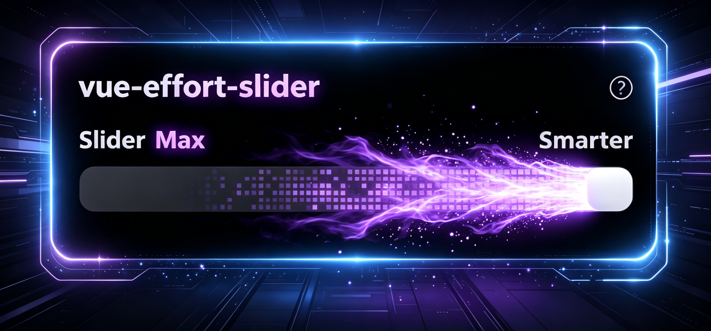
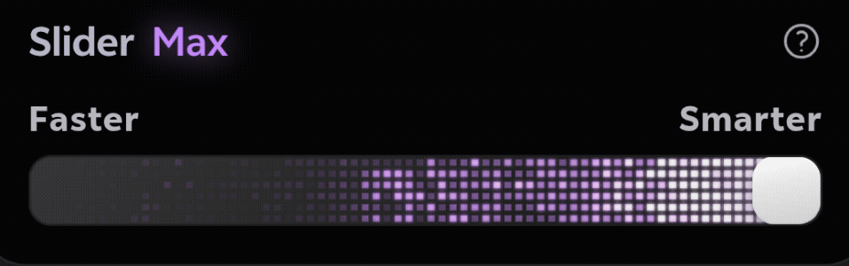

# vue-effort-slider

[](https://www.npmjs.com/package/vue-effort-slider)
[](./LICENSE)

[English](./README.md) | [中文](./README.zh-CN.md)

一个高度可定制的 Vue 3 范围滑块组件，内置实时 WebGL 火焰拖尾特效。灵感来自 Claude Code 的 Effort 滑块，支持平滑吸附动画、动态颜色主题和 GPU 加速粒子渲染。



<br>



## 特性

- **WebGL2 火焰拖尾** — 实时 GPU 渲染的火焰效果，滑块达到阈值时自动激活
- **吸附动画** — 平滑的三次缓出动画，松手后自动吸附到最近的 25% 刻度
- **完全可主题化** — 10+ 个颜色属性，可自定义每个视觉元素（滑块、拖尾、轨道、标签、发光）
- **v-model 支持** — 标准 Vue 双向绑定
- **Squircle 裁剪** — Apple 风格超椭圆裁剪路径，应用于卡片和轨道
- **响应式宽度** — 支持像素值或 CSS 字符串
- **帮助提示** — 内置帮助图标和基于 Teleport 的 tooltip
- **轻量零依赖** — 运行时无额外依赖，仅需 Vue 3 作为 peer dependency

## 安装

```bash
npm install vue-effort-slider
```

## 从零开始

```bash
# 1. 创建项目
npm create vite@latest my-slider -- --template vue
cd my-slider
npm install vue-effort-slider
```

修改 `src/App.vue`：

```vue
<script setup>
import { ref } from 'vue'
import { EffortSlider } from 'vue-effort-slider'
import 'vue-effort-slider/style.css'

const value = ref(75)
</script>

<template>
  <EffortSlider v-model="value" />
  <p style="color:#71717a;text-align:center;margin-top:16px">当前值：{{ value }}</p>
</template>
```

```bash
# 2. 运行
npm run dev
```

打开 `http://localhost:5173` — 带火焰拖尾的滑块已就绪。

## 快速开始

### 全局注册

```js
// main.js
import { createApp } from 'vue'
import App from './App.vue'
import VueEffortSlider from 'vue-effort-slider'
import 'vue-effort-slider/style.css'

const app = createApp(App)
app.use(VueEffortSlider)
app.mount('#app')
```

```vue
<template>
  <EffortSlider v-model="value" />
</template>

<script setup>
import { ref } from 'vue'
const value = ref(75)
</script>
```

### 局部导入

```vue
<template>
  <EffortSlider v-model="value" label="思考深度" />
</template>

<script setup>
import { ref } from 'vue'
import { EffortSlider } from 'vue-effort-slider'
import 'vue-effort-slider/style.css'

const value = ref(50)
</script>
```

### 子模块导入

每个模块可单独导入，支持 tree-shaking：

```js
// 完整组件
import { EffortSlider } from 'vue-effort-slider'
import 'vue-effort-slider/style.css'

// 仅组件
import { EffortSlider } from 'vue-effort-slider/EffortSlider'

// 单独导入 composable
import { useSliderState } from 'vue-effort-slider/useSliderState'
import { useWebglFire } from 'vue-effort-slider/useWebglFire'

// 或从 composables 批量导入
import { useSliderState, useWebglFire } from 'vue-effort-slider/composables'

// 仅着色器（GLSL 源码字符串）
import { VERT, FRAG_SIM, FRAG_BLUR, FRAG_COMP } from 'vue-effort-slider/shaders'
```

### 独立火焰画布

使用 `useWebglFire` 将火焰拖尾效果添加到任意 canvas：

```vue
<template>
  <canvas ref="canvasRef" width="400" height="60"
    style="width:400px;height:60px;border-radius:10px;background:#0c0c0c" />
</template>

<script setup>
import { ref } from 'vue'
import { useWebglFire } from 'vue-effort-slider/useWebglFire'

const canvasRef = ref(null)
const sliderValue = ref(100)
const isActive = ref(true)

useWebglFire(canvasRef, sliderValue, isActive, () => '#a857f7')
</script>
```

## Props

### 基础属性

| 属性 | 类型 | 默认值 | 说明 |
|------|------|--------|------|
| `modelValue` | `Number` | `75` | 当前滑块值，支持 `v-model`。范围：`0` 到 `100` |
| `width` | `String \| Number` | `376` | 组件宽度。接受数字（像素）或 CSS 字符串（如 `'100%'`） |
| `label` | `String` | `'Slider'` | 头部标签文字，显示在状态文本旁边 |
| `threshold` | `Number` | `100` | 激活 WebGL 火焰效果的阈值。设为 `100` 则仅在最大值时激活 |
| `scaleLabels` | `String[]` | `['Faster', 'Smarter']` | 两个元素的数组，分别对应轨道左端和右端的标签文字 |
| `statusLabels` | `Object` | `{ level1: 'Minimal', level2: 'Low', level3: 'Medium', level4: 'High', level5: 'Max' }` | 5 个挡位各自的状态文本 |
| `background` | `String` | `'#000000'` | 卡片背景色（任意 CSS 颜色值） |
| `borderRadius` | `String \| Number` | `20` | 卡片圆角半径（像素） |
| `showHelp` | `Boolean` | `true` | 是否显示头部的帮助图标 |
| `helpText` | `String` | `'Drag the slider to adjust AI thinking depth'` | 点击帮助图标时显示的 tooltip 内容 |

### 颜色属性

所有颜色属性接受任意有效的 CSS 颜色值（hex、rgb、hsl 等）。

| 属性 | 类型 | 默认值 | 说明 |
|------|------|--------|------|
| `labelColor` | `String` | `'#b0b0c7'` | 头部标签文字颜色（如 "Effort"） |
| `statusColor` | `String` | `'#a1a1aa'` | 滑块未达到阈值时的状态文本颜色 |
| `activeColor` | `String` | `'#c084fc'` | 滑块达到阈值时的状态文本颜色（带发光效果） |
| `highlightColor` | `String` | `'#c084fc'` | 滑块达到阈值时的滑块发光颜色 |
| `scaleLabelColor` | `String` | `'#b0b0b8'` | 端点标签文字颜色（"Faster" / "Smarter"） |
| `helpIconColor` | `String` | `'#a1a1aa'` | 帮助图标颜色 |
| `trailColor` | `String` | `'#a857f7'` | WebGL 火焰拖尾效果颜色 |
| `thumbColor` | `String` | `'#ffffff'` | 可拖动滑块的颜色 |
| `trackColor` | `String` | `'#0c0c0c'` | 滑块轨道的背景颜色 |
| `dotColor` | `String` | `'#494950'` | 轨道上 5 个装饰圆点的颜色 |

## 事件

| 事件 | 载荷 | 说明 |
|------|------|------|
| `update:modelValue` | `Number` | 拖动过程中持续触发，用于 `v-model` 双向绑定 |
| `change` | `Number` | 拖动结束且吸附动画完成后触发一次，载荷为最终吸附后的值 |
| `help` | — | 点击帮助图标时触发 |

## 示例

### 基础用法

```vue
<template>
  <EffortSlider v-model="value" />
</template>

<script setup>
import { ref } from 'vue'
import { EffortSlider } from 'vue-effort-slider'
import 'vue-effort-slider/style.css'

const value = ref(50)
</script>
```

### 自定义标签和颜色

```vue
<template>
  <EffortSlider
    v-model="depth"
    label="思考深度"
    :width="400"
    :scale-labels="['快速', '精准']"
    :status-labels="{
      level1: '极简',
      level2: '简单',
      level3: '一般',
      level4: '深入',
      level5: '极致'
    }"
    trail-color="#8b5cf6"
    highlight-color="#a78bfa"
    active-color="#c084fc"
    thumb-color="#ffffff"
    track-color="#0a0a0a"
    background="#000000"
    help-text="拖动滑块调整 AI 思考深度"
  />
</template>

<script setup>
import { ref } from 'vue'
import { EffortSlider } from 'vue-effort-slider'
import 'vue-effort-slider/style.css'

const depth = ref(50)
</script>
```

### 监听事件

```vue
<template>
  <EffortSlider
    v-model="value"
    @change="onValueChanged"
    @help="onHelpClicked"
  />
  <p>当前值: {{ value }}</p>
</template>

<script setup>
import { ref } from 'vue'
import { EffortSlider } from 'vue-effort-slider'
import 'vue-effort-slider/style.css'

const value = ref(75)

function onValueChanged(val) {
  console.log('滑块最终值:', val)
}

function onHelpClicked() {
  console.log('帮助图标被点击')
}
</script>
```

### 自定义宽度

```vue
<template>
  <!-- 像素值 -->
  <EffortSlider v-model="v1" :width="300" />

  <!-- CSS 字符串 -->
  <EffortSlider v-model="v2" width="100%" />
</template>
```

## 工作原理

### 渲染管线

火焰拖尾效果使用 4-pass WebGL2 渲染管线：

1. **模拟 pass** — 使用细胞噪声、衰减、火花和边缘光计算火焰图案
2. **水平模糊** — 7-tap 高斯模糊（水平方向）
3. **垂直模糊** — 7-tap 高斯模糊（垂直方向）
4. **合成 pass** — 将场景和发光纹理进行色调映射合成

### 性能优化

- 渲染循环使用缓存的 reactive 值，避免 Vue 依赖追踪开销
- 不活跃 180 帧后自动停止 rAF 循环
- 使用 `ResizeObserver` 高效管理 canvas 尺寸
- Canvas 使用 `opacity: 0` 而非 `display: none`，防止 Chrome 下 WebGL context 休眠

### 吸附动画

用户松手后，滑块使用三次缓出曲线在 220ms 内平滑动画到最近的 25% 刻度。

## 浏览器支持

- Chrome 90+
- Firefox 90+
- Safari 15+
- Edge 90+

需要 WebGL2 支持。所有现代桌面和移动浏览器均支持 WebGL2。

## 依赖要求

- Vue 3.3+
- 支持 WebGL2 的浏览器

## 致谢

感谢 [254558/claude-range-slider](https://github.com/254558/claude-range-slider) 的开源项目。

## 许可证

MIT
